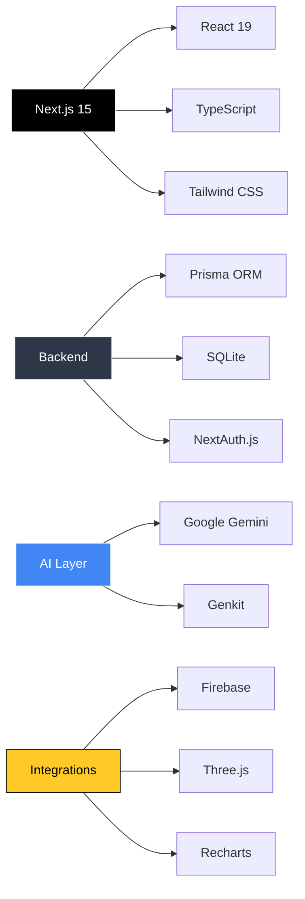
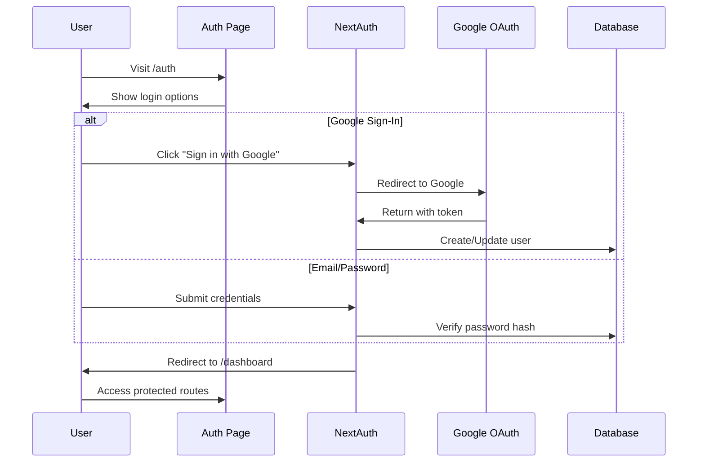

<div align="center">

# 🌾 AgroTrack

### *AI-Powered Agriculture Monitoring & Analytics Platform*

[](https://nextjs.org/)
[](https://www.typescriptlang.org/)
[](https://www.prisma.io/)
[](https://firebase.google.com/)
[](LICENSE)

**[🚀 Live Demo](#) • [📖 Documentation](#getting-started) • [🐛 Report Bug](#) • [✨ Request Feature](#)**

---


</div>

## 🎯 **What is AgroTrack?**

AgroTrack transforms agricultural monitoring through cutting-edge technology. Built with **Next.js 15**, powered by **Google's Gemini AI**, and backed by a robust **Prisma + SQLite** stack, it delivers real-time insights, predictive analytics, and stunning 3D visualizations for modern farming.

<div align="center">

### **🌟 Key Highlights**

</div>

```ascii
╔══════════════════════════════════════════════════════════════╗
║  🤖 AI-Powered Analytics    📊 Real-time Dashboards         ║
║  🔐 Secure Authentication   🎨 Modern UI/UX                 ║
║  🌐 3D Visualizations       📱 Responsive Design            ║
║  ⚡ Lightning Fast           🔄 Live Updates                 ║
╚══════════════════════════════════════════════════════════════╝
```

---

## ✨ **Features That Set Us Apart**

<table>
<tr>
<td width="50%">

### 🧠 **AI-Driven Intelligence**
- **Gemini-Powered Insights** for crop recommendations
- **Predictive Analytics** for yield optimization
- **Smart Alerts** for weather & pest management
- **Natural Language Queries** via Genkit integration

</td>
<td width="50%">

### 📊 **Rich Visualizations**
- **Interactive 3D Models** with Three.js
- **Dynamic Charts** using Recharts
- **Real-time Data Streaming**
- **Customizable Dashboards**

</td>
</tr>
<tr>
<td width="50%">

### 🔒 **Enterprise-Grade Security**
- **NextAuth.js** authentication
- **Google OAuth** integration
- **Bcrypt** password hashing
- **JWT** session management

</td>
<td width="50%">

### 🎨 **Modern Design System**
- **Tailwind CSS** + **shadcn/ui**
- **Radix UI** primitives
- **Framer Motion** animations
- **Lucide Icons** library

</td>
</tr>
</table>

---

## 🏗️ **Tech Stack**

<div align="center">



</div>

### **Frontend Arsenal**
```typescript
const frontend = {
  framework: "Next.js 15 (App Router)",
  language: "TypeScript",
  styling: ["Tailwind CSS", "shadcn/ui", "Radix UI"],
  state: ["React 19", "React Hook Form"],
  animation: ["Framer Motion", "tailwindcss-animate"],
  icons: "Lucide React"
}
```

### **Backend Infrastructure**
```typescript
const backend = {
  orm: "Prisma Client",
  database: "SQLite (better-sqlite3)",
  auth: "NextAuth.js",
  api: "Next.js API Routes",
  validation: ["Zod", "@hookform/resolvers"]
}
```

### **AI & Visualization**
```typescript
const advanced = {
  ai: ["Google Gemini", "Genkit", "@genkit-ai/google-genai"],
  visualization: ["Recharts", "Three.js", "@react-three/fiber", "@react-three/drei"],
  utilities: ["date-fns", "clsx", "class-variance-authority"]
}
```

---

## 🚀 **Quick Start**

### **Prerequisites**

```bash
node >= 18.0.0
npm >= 9.0.0
```

### **⚡ Installation**

```bash
# 1️⃣ Clone the repository
git clone https://github.com/yourusername/agrotrack.git
cd agrotrack

# 2️⃣ Install dependencies
npm install

# 3️⃣ Set up environment variables
cp .env.example .env
# Edit .env with your credentials

# 4️⃣ Generate Prisma Client
npx prisma generate

# 5️⃣ Run migrations
npx prisma migrate dev

# 6️⃣ Start development server
npm run dev
```

<div align="center">

**🎉 Open [http://localhost:9002](http://localhost:9002) and start farming smarter!**

</div>

---

## 🔧 **Environment Configuration**

Create a `.env` file in the root directory:

```bash
# 🤖 AI Configuration
GEMINI_API_KEY="your_gemini_api_key_here"

# 💾 Database
DATABASE_URL="file:./prisma/dev.db"

# 🔐 Authentication
NEXTAUTH_URL="http://localhost:9002"
NEXTAUTH_SECRET="generate_a_secure_random_string"

# 🌐 Google OAuth
GOOGLE_CLIENT_ID="your_google_client_id"
GOOGLE_CLIENT_SECRET="your_google_client_secret"
```

<details>
<summary><b>🔍 How to get Google OAuth credentials</b></summary>

1. Go to [Google Cloud Console](https://console.cloud.google.com/)
2. Create a new project or select existing
3. Navigate to **APIs & Services > Credentials**
4. Create **OAuth 2.0 Client ID**
5. Add authorized origins: `http://localhost:9002`
6. Add redirect URI: `http://localhost:9002/api/auth/callback/google`
7. Copy Client ID and Secret to `.env`

</details>

---

## 📦 **Available Scripts**

| Command | Description |
|---------|-------------|
| `npm run dev` | 🔥 Start development server with Turbopack on port 9002 |
| `npm run build` | 📦 Build for production |
| `npm start` | 🚀 Start production server |
| `npm run lint` | 🔍 Run ESLint |
| `npm run typecheck` | ✅ Check TypeScript types |
| `npm run genkit:dev` | 🤖 Start Genkit AI development server |
| `npm run genkit:watch` | 👀 Start Genkit in watch mode |

---

## 🗂️ **Project Structure**

```
AgroTrack/
├── 📁 src/
│   ├── 🎨 app/              # Next.js App Router pages & API routes
│   │   ├── api/             # Backend API endpoints
│   │   ├── auth/            # Authentication pages
│   │   └── dashboard/       # Main dashboard
│   │
│   ├── 🧩 components/       # Reusable React components
│   │   ├── ui/              # shadcn/ui components
│   │   └── charts/          # Visualization components
│   │
│   ├── 🤖 ai/               # Genkit & Gemini integration
│   ├── 🔥 firebase/         # Firebase configuration
│   ├── 🎣 hooks/            # Custom React hooks
│   ├── 📚 lib/              # Utility functions & configs
│   ├── 🌍 locales/          # i18n translations
│   └── 🎭 context/          # React context providers
│
├── 🗄️ prisma/
│   ├── schema.prisma        # Database schema
│   ├── migrations/          # Database migrations
│   └── dev.db              # SQLite database file
│
├── ⚙️ Configuration Files
│   ├── next.config.ts       # Next.js configuration
│   ├── tailwind.config.ts   # Tailwind CSS settings
│   ├── tsconfig.json        # TypeScript configuration
│   └── prisma.config.ts     # Prisma configuration
│
└── 📄 Documentation
    ├── README.md            # You are here!
    └── .env.example         # Environment template
```

---

## 🔐 **Authentication Flow**



**Security Features:**
- 🔒 Bcrypt password hashing
- 🎫 JWT-based sessions
- 🌐 OAuth 2.0 with Google
- 🛡️ CSRF protection
- ⏱️ Session expiration

---

## 💾 **Database Schema**

```prisma
model User {
  id           String   @id @default(cuid())
  name         String?
  email        String   @unique
  passwordHash String
  createdAt    DateTime @default(now())
  updatedAt    DateTime @updatedAt
}
```

**Prisma Commands:**
```bash
npx prisma studio          # Open Prisma Studio GUI
npx prisma migrate dev     # Create and apply migration
npx prisma generate        # Regenerate Prisma Client
npx prisma db push         # Push schema without migration
```

---

## 🤖 **AI Integration**

AgroTrack leverages **Google's Gemini AI** through **Genkit** for intelligent features:

### **Capabilities**
- 🌱 **Crop Recommendations** based on soil & climate
- 📈 **Yield Predictions** using historical data
- 🌤️ **Weather Impact Analysis**
- 🐛 **Pest & Disease Detection**
- 💬 **Natural Language Queries**

### **Usage Example**

```typescript
import { genkit } from '@genkit-ai/core';
import { gemini15Flash } from '@genkit-ai/google-genai';

const ai = genkit({
  plugins: [googleAI()],
  model: gemini15Flash
});

const response = await ai.generate({
  prompt: 'Analyze crop health from image',
  config: { temperature: 0.7 }
});
```

---

## 🎨 **UI Components**

Built with **shadcn/ui** and **Radix UI** for accessibility and customization:

```tsx
import { Button } from '@/components/ui/button';
import { Card } from '@/components/ui/card';
import { LineChart } from 'recharts';

<Card className="p-6">
  <LineChart data={cropData}>
    <Line dataKey="yield" stroke="#10b981" />
  </LineChart>
  <Button variant="default">Analyze Trends</Button>
</Card>
```

**Component Library:**
- Buttons, Cards, Dialogs, Dropdowns
- Forms, Inputs, Select boxes
- Toast notifications, Tooltips
- Tabs, Accordions, Progress bars

---

## 🐛 **Troubleshooting**

<details>
<summary><b>🔴 Prisma Client Error</b></summary>

```bash
Error: Cannot find module '.prisma/client/default'
```

**Solution:**
```bash
npm install
npx prisma generate
npm run dev
```

</details>

<details>
<summary><b>🔴 NextAuth Configuration Error</b></summary>

```bash
[NEXTAUTH_URL] Missing NEXTAUTH_URL
```

**Solution:**
Add to `.env`:
```bash
NEXTAUTH_URL="http://localhost:9002"
NEXTAUTH_SECRET="your-secret-here"
```

</details>

<details>
<summary><b>🔴 Google OAuth Error</b></summary>

```bash
Error: client_id is required
```

**Solution:**
1. Verify `.env` has valid `GOOGLE_CLIENT_ID` and `GOOGLE_CLIENT_SECRET`
2. Check Google Cloud Console redirect URIs match `http://localhost:9002/api/auth/callback/google`
3. Restart dev server

</details>

---

## 🚀 **Deployment**

### **Production Build**

```bash
# Build the application
npm run build

# Start production server
npm start
```

### **Deployment Platforms**

| Platform | Documentation |
|----------|---------------|
| Vercel | [Deploy to Vercel](https://vercel.com/docs) |
| Firebase Hosting | [Firebase Deploy](https://firebase.google.com/docs/hosting) |
| AWS Amplify | [AWS Amplify Docs](https://docs.amplify.aws/) |
| Docker | `docker build -t agrotrack .` |

---

## 📈 **Roadmap**

- [ ] 🌍 Multi-language support (i18n)
- [ ] 📱 Native mobile apps (React Native)
- [ ] 🎥 Live video streaming from farm cameras
- [ ] 🤝 Multi-tenant organization support
- [ ] 📊 Advanced ML models for precision farming
- [ ] 🔌 IoT sensor integration
- [ ] 📧 Email notification system
- [ ] 📱 SMS alerts via Twilio

---

## 🤝 **Contributing**

We welcome contributions! Here's how you can help:

1. 🍴 **Fork** the repository
2. 🌿 Create a **feature branch** (`git checkout -b feature/AmazingFeature`)
3. ✅ **Commit** your changes (`git commit -m 'Add AmazingFeature'`)
4. 📤 **Push** to the branch (`git push origin feature/AmazingFeature`)
5. 🔀 Open a **Pull Request**

### **Development Guidelines**
- Write meaningful commit messages
- Follow TypeScript best practices
- Add tests for new features
- Update documentation as needed

---

## 📝 **License**

```
MIT License

Copyright (c) 2025 AgroTrack

Permission is hereby granted, free of charge, to any person obtaining a copy
of this software and associated documentation files (the "Software"), to deal
in the Software without restriction, including without limitation the rights
to use, copy, modify, merge, publish, distribute, sublicense, and/or sell
copies of the Software...
```

[Read Full License](LICENSE)

---

## 💬 **Support**

<div align="center">

**Need help? We're here for you!**

[](https://discord.gg/agrotrack)
[](mailto:support@agrotrack.com)
[](https://twitter.com/agrotrack)

</div>

---

## 🌟 **Acknowledgments**

- [Next.js](https://nextjs.org/) - The React Framework
- [Prisma](https://www.prisma.io/) - Next-generation ORM
- [Google Gemini](https://deepmind.google/technologies/gemini/) - AI Foundation
- [shadcn/ui](https://ui.shadcn.com/) - Beautiful Components
- [Vercel](https://vercel.com/) - Deployment Platform

---

<div align="center">

### **Built with ❤️ for farmers worldwide**

**⭐ Star this repo if you find it helpful!**

[](https://github.com/yourusername/agrotrack)
[](https://github.com/yourusername/agrotrack/fork)
[](https://github.com/yourusername/agrotrack)

---


**Made with 💻 and ☕ by the AgroTrack Team**

</div>
